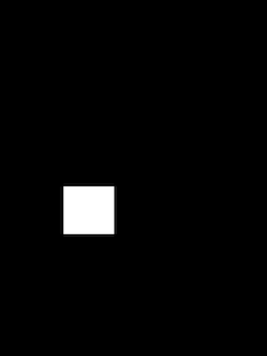
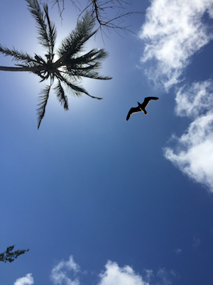

# 【COMP8501】Assignment1

##### Please accomplish **one** of the following two tasks:

1. Implement one of the traditional 2D Image-Based graphics algorithms:

   - Poisson Image Editing

   - Graph Cut

   - GrabCut

   You must **reimplement the algorithm by yourself**. 

2. Implement one of the deep learning 2D Image-Based graphics algorithms:

   - Fully Convolutional Networks for Semantic Segmentation

   - CycleGAN

   You may use open source framework/implementation. But you have to **train the model by yourself and include the trained model in your submission**.

​		You may also choose other deep learning 2D Image-Based graphics algorithms from published paper or your own project.

​		The technical report should include detailed parameters showing the model convergence.

##### Requirements:

1. Technical report, source code, example images are expected to be submitted through Moodle.
2. There should be detailed instructions on how to run your code. TA will run your code against testing datasets and will deduct marks if the instructions are unclear.
3. The reimplemented algorithm is expected to have comparable performance with the original paper. You should evaluate the performance in the technical report.
4. Recommended programming languages: C++/Java/Python/MATLAB


# Problem Analysis

Calculate the range of the mask area

```python
laplacian = cv2.Laplacian(np.float64(source), ddepth=-1, ksize=1)
indices = np.nonzero(mask)
x_begin, x_end, y_begin, y_end = np.min(indices[0]) - 1, np.max(indices[0]) + 1, np.min(indices[1]) - 1, np.max(indices[1]) + 1
mask = mask[x_begin: x_end, y_begin: y_end]
source = source[x_begin: x_end, y_begin: y_end]
laplacian = laplacian[x_begin: x_end, y_begin: y_end]
```

Solve channel by channel

```python
result = [spsolve(a, final_mask, b) for a, b in zip(cv2.split(target), cv2.split(final_laplacian))]
final = cv2.merge(result)
```

Set up the matrix equation Ap = b

```python
A = lil_matrix((num_pixels, num_pixels), dtype=np.float64)
b = np.ndarray((num_pixels, ), dtype=np.float64)
```

Mapping from (x, y) to the index in the matrix/vector

```python
index_map = {(x, y): i for i, (x, y) in enumerate(zip(indices[0], indices[1]))}
```

Construct A and b

```python
for i, (x, y) in enumerate(zip(indices[0], indices[1])):
    A[i, i] = -4
    b[i] = lap[x, y]
    p = [(x + dx[j], y + dy[j]) for j in range(4)]
    for j in range(4):
        if p[j] in index_map:
            A[i, index_map[p[j]]] = 1
        else:
            b[i] -= target[p[j]]
```

Solve the linear system

```python
X = linalg.splu(A).solve(b)
```

Construct the solution image

```python
result = np.copy(target)
for i, (x, y) in enumerate(zip(indices[0],indices[1])):
    if X[i] < 0:
        X[i] = 0
    if X[i] > 255:
        X[i] = 255
    result[x, y] = X[i]
```


# Environmental Requirements

- python=3.8
- opencv-python=4.9.0.80
- numpy=1.21.2
- scipy=1.8.0


# Source Code

main.py

```python
import cv2
import argparse

from poisson import poisson_edit


def main(args):
    source = cv2.imread(args.src_img)
    target = cv2.imread(args.tgt_img)
    mask = cv2.imread(args.mask_img)[:, :, 0]
    height, width = target.shape[:2]
    center = (width // 2, height // 2)
    output = poisson_edit(source, target, mask, center)
    cv2.imwrite(args.res_img, output)


if __name__=="__main__":
    parser = argparse.ArgumentParser()
    parser.add_argument("--src_img", type=str, default="source.jpg")
    parser.add_argument("--tgt_img", type=str, default="target.jpg")
    parser.add_argument("--mask_img", type=str, default="mask.jpg")
    parser.add_argument("--res_img", type=str, default="result.jpg")
    args = parser.parse_args()

    main(args)
```

poisson.py

```python
import cv2
import numpy as np
from scipy.sparse import lil_matrix, linalg


def spsolve(target, mask, lap):
    indices = np.nonzero(mask)
    num_pixels = indices[0].shape[0] 

    A = lil_matrix((num_pixels, num_pixels), dtype=np.float64)
    b = np.ndarray((num_pixels, ), dtype=np.float64)
    
    index_map = {(x, y): i for i, (x, y) in enumerate(zip(indices[0], indices[1]))}
    dx = [1, 0, -1, 0]
    dy = [0, 1, 0, -1]
    for i, (x, y) in enumerate(zip(indices[0], indices[1])):
        A[i, i] = -4
        b[i] = lap[x, y]
        p = [(x + dx[j], y + dy[j]) for j in range(4)]
        for j in range(4):
            if p[j] in index_map:
                A[i, index_map[p[j]]] = 1
            else:
                b[i] -= target[p[j]]
                
    A = A.tocsc()
    X = linalg.splu(A).solve(b)

    result = np.copy(target)
    for i, (x, y) in enumerate(zip(indices[0],indices[1])):
        if X[i] < 0:
            X[i] = 0
        if X[i] > 255:
            X[i] = 255
        result[x, y] = X[i]

    return result


def poisson_edit(source, target, mask, center):
    laplacian = cv2.Laplacian(np.float64(source), ddepth=-1, ksize=1)

    indices = np.nonzero(mask)
    x_begin, x_end, y_begin, y_end = np.min(indices[0]) - 1, np.max(indices[0]) + 1, np.min(indices[1]) - 1, np.max(indices[1]) + 1

    mask = mask[x_begin: x_end, y_begin: y_end]
    source = source[x_begin: x_end, y_begin: y_end]
    laplacian = laplacian[x_begin: x_end, y_begin: y_end]

    final_mask = np.zeros((target.shape[0], target.shape[1]))
    final_source = np.zeros_like(target)
    final_laplacian = np.zeros_like(target, dtype=np.float64)

    x_mid = (np.max(indices[0]) - np.min(indices[0])) // 2 + 1
    x_begin = center[0] - x_mid
    x_end = center[0] + mask.shape[0] - x_mid
    y_mid = (np.max(indices[1]) - np.min(indices[1])) // 2 + 1
    y_begin = center[1] - y_mid
    y_end = center[1] + mask.shape[1] - y_mid

    final_mask[x_begin: x_end, y_begin: y_end] = mask
    final_source[x_begin: x_end, y_begin: y_end] = source
    final_laplacian[x_begin: x_end, y_begin: y_end] = laplacian

    result = [spsolve(a, final_mask, b) for a, b in zip(cv2.split(target), cv2.split(final_laplacian))]
    
    final = cv2.merge(result)
    return final
```

run_pie.sh

```sh
source_image_path=img/source.png
target_image_path=img/target.png
mask_path=img/mask.png
result_image_path=img/result.png

python main.py \
    --src_img ${source_image_path} \
    --tgt_img ${target_image_path} \
    --mask_img ${mask_path} \
    --res_img ${result_image_path} \
```

Run command in terminal：

```shell
sh scripts/run_pie.sh
```


# Example Images

source.png


target.png


mask.png



result.png



