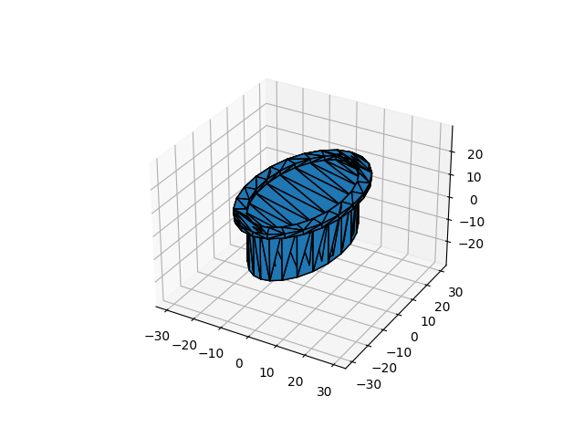
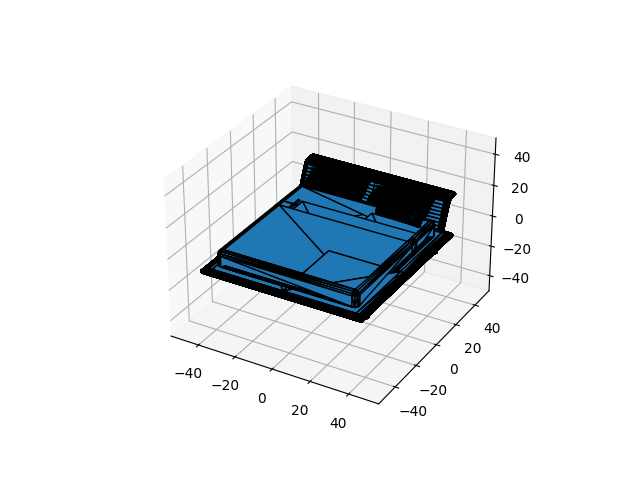
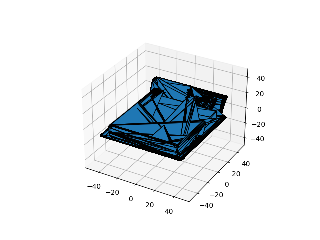

# 【COMP8501】Assignment 2

**Tasks:**

**a. Mesh Simplification**

(1) Implement a Mesh Simplification algorithm;

(2) Use the implemented algorithm to simplify a 3D model (e.g. Stanford Bunny);

(3) Here is a list of datasets you may be interested in:

- https://modelnet.cs.princeton.edu
- https://ps.is.tuebingen.mpg.de/research_projects/faust-dataset
- http://yulanguo.me/dataset.html
- http://faust.is.tue.mpg.de


**b. Mesh Denoising**

(1) Implement a Mesh Denoising algorithm;

(2) Use the implemented algorithm to denoise mesh in a 3D model;

(3) To test the algorithm, you can add noise to the existing model with Blender, or you may consider the scanned dataset. Here is a list of scanned datasets you may be interested in:

- http://www.michaelfirman.co.uk/RGBDdatasets/index.html
- http://redwood-data.org/3dscan/


**c. Ray Tracing**

(1) Implement a Ray Tracing algorithm;

(2) Render a simple scene(e.g. cylinder on a plane) using the implemented algorithm; 

(3) You may try different material parameters and lighting conditions.


**Requirements:**

1. Please accomplish **ONE** of the three tasks;

2. Recommended programming languages: C++/Java/Python/MATLAB;

3. Technical report (printed as pdf), resource data (e.g. 3D model, texture map), source code and instruction file are expected to be submitted in Moodle; 

4. In your technical report, you should cover your implementation details, present your results, and evaluate them via comprehensive discussion. Also, please give proper references.


# Problem Analysis

We use the Vertex Decimation algorithm for mesh simplification.

First we need to read in the 3D model according to the data format.

```python
def read_off(file):
    if 'OFF' != file.readline().strip():
        raise ValueError('Not an OFF file')
    n_verts, n_faces, _ = map(int, file.readline().strip().split())
    verts = [[float(s) for s in file.readline().strip().split()] for _ in range(n_verts)]
    faces = [[int(s) for s in file.readline().strip().split()][1:] for _ in range(n_faces)]
    return verts, faces
```


Then construct the Mesh class, where `compute_vertex_error` is a simple error metric based on the inverse of the vertex degree. `renumber_vertices_and_faces` renumbers vertices and updates faces after vertex removal.

```python
class Mesh:
    def __init__(self, vertices, faces):
        self.vertices = vertices
        self.faces = faces

        self.num_vertices = len(vertices)
        self.num_faces = len(faces)
        self.vertex_error = [0] * self.num_vertices

        self.compute_vertex_error()

    def compute_vertex_error(self):
        vertex_degree = [0] * self.num_vertices

        for face in self.faces:
            for vertex in face:
                vertex_degree[vertex] += 1

        self.vertex_error = [1.0 / degree if degree > 0 else float('inf') for degree in vertex_degree]

    def renumber_vertices_and_faces(self):
        old_to_new_indices = {old_idx: new_idx for new_idx, old_idx in enumerate(sorted(set(vertex for face in self.faces for vertex in face)))}
        self.faces = [[old_to_new_indices[vertex] for vertex in face] for face in self.faces]
        used_vertices = set(idx for face in self.faces for idx in face)
        self.vertices = [self.vertices[i] for i in sorted(used_vertices)]


    def print(self):
        print(f"Num of vertices: {len(self.vertices)}.")
        print(f"Num of faces: {len(self.faces)}.")
```


Now we specify the number of simplified vertices and delete vertices until the requirements are met.

```python
def simplify_mesh(mesh, target_num_vertices):
    while len(mesh.vertices) > target_num_vertices:
        remove_count = len(mesh.vertices) - target_num_vertices
        remove_vertex(mesh, remove_count)
        if remove_count <= 0:
            break  # Stop if we cannot remove more vertices without breaking the mesh

    return mesh
```


When removing vertices, we first remove the vertices with the smallest vertex error. According to the theorem that three points form a face, we need to ensure that each face has at least three vertices. After removing the vertices, the simplified vertices must be renumbered and the vertex error must be recalculated.

```python
def remove_vertex(mesh, target_vertices):
    sorted_vertices = sorted(range(len(mesh.vertex_error)), key=lambda i: mesh.vertex_error[i], reverse=True)
    to_remove = set(sorted_vertices[:target_vertices])

    new_faces = []
    for face in mesh.faces:
        new_face = [v for v in face if v not in to_remove]
        if len(new_face) >= 3:
            new_faces.append(new_face)

    mesh.faces = new_faces
    mesh.renumber_vertices_and_faces()
    mesh.compute_vertex_error()
```


Visualize the mesh.

```python
def plot_mesh(vertices, faces):
    fig = plt.figure()
    ax = fig.add_subplot(111, projection='3d')
    
    # Create a Poly3DCollection from the faces and vertices
    poly3d = [[vertices[vert_id] for vert_id in face] for face in faces]
    mesh = Poly3DCollection(poly3d, edgecolor='k')
    ax.add_collection3d(mesh)

    # Auto scale to the mesh size
    scale = np.concatenate([np.array(vertices)]).flatten()
    ax.auto_scale_xyz(scale, scale, scale)

    plt.show()
```


# Environmental Requirements

- python=3.8
- numpy=1.23.3
- matplotlib=3.6.1

# Source Code

main.py

```python
import argparse

from model import Mesh, simplify_mesh
from utils import read_off, plot_mesh


def main(args):
    with open(args.data, 'r') as file:
        vertices, faces = read_off(file)

    mesh = Mesh(vertices, faces)
    mesh.print()

    plot_mesh(mesh.vertices, mesh.faces)

    simplified_mesh = simplify_mesh(mesh, int(args.del_proportion * mesh.num_vertices))
    simplified_mesh.print()

    plot_mesh(simplified_mesh.vertices, simplified_mesh.faces)


if __name__=="__main__":
    parser = argparse.ArgumentParser(description='Params')
    parser.add_argument('--data', default='ModelNet10', type=str, help='dataset name')
    parser.add_argument('--del_proportion', default=0.5, type=float, help='delete proportion')
    args = parser.parse_args()

    main(args)
```


model.py

```python
class Mesh:
    def __init__(self, vertices, faces):
        self.vertices = vertices
        self.faces = faces

        self.num_vertices = len(vertices)
        self.num_faces = len(faces)
        self.vertex_error = [0] * self.num_vertices

        self.compute_vertex_error()

    def compute_vertex_error(self):
        vertex_degree = [0] * self.num_vertices

        for face in self.faces:
            for vertex in face:
                vertex_degree[vertex] += 1

        self.vertex_error = [1.0 / degree if degree > 0 else float('inf') for degree in vertex_degree]

    def renumber_vertices_and_faces(self):
        old_to_new_indices = {old_idx: new_idx for new_idx, old_idx in enumerate(sorted(set(vertex for face in self.faces for vertex in face)))}
        self.faces = [[old_to_new_indices[vertex] for vertex in face] for face in self.faces]
        used_vertices = set(idx for face in self.faces for idx in face)
        self.vertices = [self.vertices[i] for i in sorted(used_vertices)]


    def print(self):
        print(f"Num of vertices: {len(self.vertices)}.")
        print(f"Num of faces: {len(self.faces)}.")


def remove_vertex(mesh, target_vertices):
    sorted_vertices = sorted(range(len(mesh.vertex_error)), key=lambda i: mesh.vertex_error[i], reverse=True)
    to_remove = set(sorted_vertices[:target_vertices])

    new_faces = []
    for face in mesh.faces:
        new_face = [v for v in face if v not in to_remove]
        if len(new_face) >= 3:  # Keep faces with at least 3 vertices
            new_faces.append(new_face)

    mesh.faces = new_faces
    mesh.renumber_vertices_and_faces()
    mesh.compute_vertex_error()  # Recompute errors after removal


def simplify_mesh(mesh, target_num_vertices):
    while len(mesh.vertices) > target_num_vertices:
        remove_count = len(mesh.vertices) - target_num_vertices
        remove_vertex(mesh, remove_count)
        if remove_count <= 0:
            break  # Stop if we cannot remove more vertices without breaking the mesh

    return mesh
```


utils.py

```python
import numpy as np
import matplotlib.pyplot as plt
from mpl_toolkits.mplot3d.art3d import Poly3DCollection


def read_off(file):
    if 'OFF' != file.readline().strip():
        raise ValueError('Not an OFF file')
    n_verts, n_faces, _ = map(int, file.readline().strip().split())
    verts = [[float(s) for s in file.readline().strip().split()] for _ in range(n_verts)]
    faces = [[int(s) for s in file.readline().strip().split()][1:] for _ in range(n_faces)]
    return verts, faces


def plot_mesh(vertices, faces):
    fig = plt.figure()
    ax = fig.add_subplot(111, projection='3d')
    
    # Create a Poly3DCollection from the faces and vertices
    poly3d = [[vertices[vert_id] for vert_id in face] for face in faces]
    mesh = Poly3DCollection(poly3d, edgecolor='k')
    ax.add_collection3d(mesh)

    # Auto scale to the mesh size
    scale = np.concatenate([np.array(vertices)]).flatten()
    ax.auto_scale_xyz(scale, scale, scale)

    plt.show()
```


run_vd.sh

```sh
data_path=path_to_off
keep_proportion=0.9

python main.py \
    --data ${data_path} \
    --keep_proportion ${keep_proportion} \
```


Run command in terminal:

```shell
sh scripts/run_vd.sh
```


# Example

We use the ModelNet10 dataset for testing.

## bathtub_0002



After Mesh Simplification


## bed_0007



After Mesh Simplification



# Reference

> Talton, J. O. (2004). A short survey of mesh simplification algorithms. *University of Illinois at Urbana-Champaign*.

> Schroeder, W. J., Zarge, J. A., & Lorensen, W. E. (1992, July). Decimation of triangle meshes. In *Proceedings of the 19th annual conference on Computer graphics and interactive techniques* (pp. 65-70).

